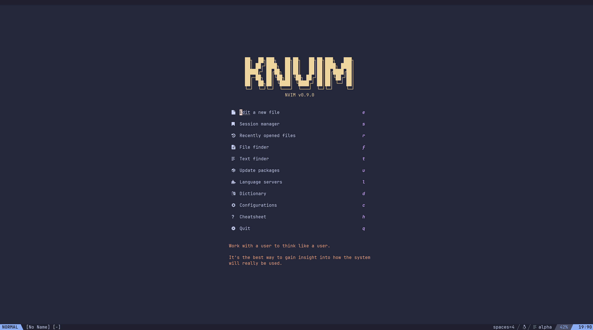
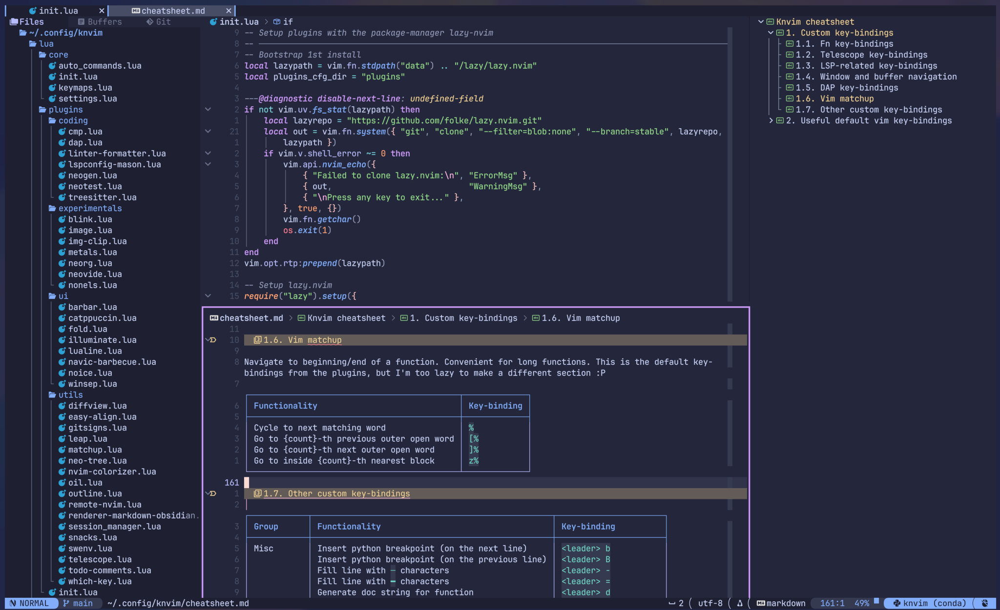
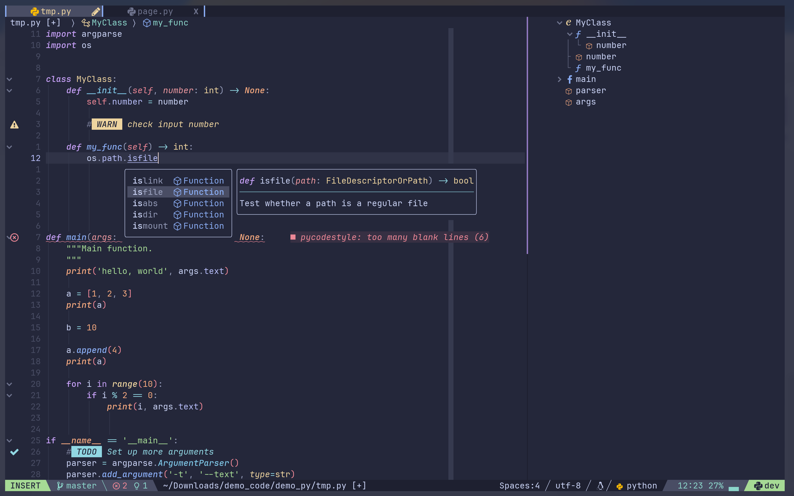

# KNVIM


K-nvim or kn-vim, personal attempt to config Neovim and a pun on my username knmac.

## 1. Demo

<!--  -->

Video demo with clickable lualine


Config structure and cheatsheet (rendered)


Editing a python file, with LSP, Tree-sitter, and outline support


## 2. Feature highlights

- Targeting python, bash, latex, markdown, and (_some_) C/C++ usage
- [Lualine](https://github.com/nvim-lualine/lualine.nvim) is configured to be (_mostly_) clickable
- Key-biddings that (_hopefully_) make sense
- Fun (_for me_) to use!!!

## 3. Content

### 3.1. Configured servers

| Language              | Name       | Category         |
| --------------------- | ---------- | ---------------- |
| Python                | pyright    | LSP              |
|                       | ruff_lsp   | Linter/Formatter |
|                       | debugpy    | DAP              |
| Bash                  | bashls     | LSP              |
|                       | shellcheck | Linter           |
| C/C++                 | clangd     | LSP              |
|                       | cpplint    | Linter           |
|                       | codelldb   | DAP              |
| Vimscript             | vim_ls     | LSP              |
| Lua                   | lua_ls     | LSP              |
| LaTex                 | texlab     | LSP              |
| Markdown              | marksman   | LSP              |
|                       | prettier   | LSP              |
| YAML                  | yamlls     | LSP              |
|                       | prettier   | Formatter        |
| Typescript/Javascript | tsserver   | LSP              |
|                       | prettier   | Formatter        |
| HTML/CSS/Json         | prettier   | Formatter        |

### 3.2. Config structure

```
init.lua
lua/
├── core/
│  ├── auto_commands.lua
│  ├── init.lua
│  ├── keymaps.lua
│  └── settings.lua
└── plugins/
   ├── coding/
   │  ├── cmp.lua
   │  ├── dap.lua
   │  ├── linter-formatter.lua
   │  ├── lspconfig-mason.lua
   │  ├── metals.lua
   │  ├── neotest.lua
   │  └── treesitter.lua
   ├── experimentals/
   │  └── ...
   ├── ui/
   │  ├── alpha.lua
   │  ├── barbar.lua
   │  ├── catppuccin.lua
   │  ├── fold.lua
   │  ├── illuminate.lua
   │  ├── indentblankline-rainbow.lua
   │  ├── lualine.lua
   │  ├── navic-barbecue.lua
   │  ├── noice-notify.lua
   │  └── winsep.lua
   ├── utils/
   │  ├── diffview.lua
   │  ├── extra.lua
   │  ├── gitsigns.lua
   │  ├── matchup.lua
   │  ├── neo-tree.lua
   │  ├── obsidian.lua
   │  ├── swenv.lua
   │  ├── outline.lua
   │  ├── telescope.lua
   │  ├── todo-comments.lua
   │  ├── toggleterm.lua
   │  ├── which-key.lua
   │  └── zen-mode.lua
   └── init.lua
```

The configs in `experimentals/` directories are not activated by default. To use them, uncommment the following line in `lua/plugins/init.lua`:

```lua
{ import = "plugins.experimentals", },
```

## 4. Manual installation

### 4.1. Dependencies

The following dependencies are for manual installation.

- Neovim 0.10.0+. Follow the installation guide on Neovim's [homepage](https://neovim.io/). This repo is just holding the config.
- A [nerdfont](https://www.nerdfonts.com) for the glyphs and a terminal that supports the font (the screenshots use [WezTerm](https://wezfurlong.org/wezterm/) and its baked-in [JetBrains Mono](https://www.jetbrains.com/lp/mono/) font).
- [npm](https://docs.npmjs.com/downloading-and-installing-node-js-and-npm) for [mason.nvim](https://github.com/williamboman/mason.nvim) (package manager for LSPs, DAPs, linters, and formaters).
- [rg](https://github.com/BurntSushi/ripgrep) and [fd](https://github.com/sharkdp/fd) for [telescope.nvim](https://github.com/nvim-telescope/telescope.nvim) (fuzzy finder).
- (Optional) Python packages `pynvim`, `neovim`, and `pylatexenc` (installable with `pip`).
- (Optional) [LazyGit](https://github.com/jesseduffield/lazygit) for quick git management from [ToggleTerm](https://github.com/akinsho/toggleterm.nvim).

### 4.2. Installation

Clone this repo to `$HOME/.config`:

```bash
git clone https://github.com/knmac/knvim.git $HOME/.config/knvim
```

Then add this command to `.bashrc` or `.zshrc`.

```bash
export NVIM_APPNAME="knvim"
```

### 4.3. Removing knvim

Simply delete the two directories `$HOME/.config/knvim` and `$HOME/.local/share/knvim`.

## 5. Installation using nvim-lazyman

[Nvim-lazyman](https://github.com/doctorfree/nvim-lazyman) is a configuration manager that supports popular Neovim configurations. After installing `nvim-lazyman`, run the folling command to install knvim:

```bash
lazyman -L Knvim
```

Follow instructions from [nvim-lazyman](https://github.com/doctorfree/nvim-lazyman) for details about installation, boostrapping, and other cool features.

## 6. Knvim Cheatsheet

Cheatsheet for knvim can be found [here](res/cheatsheet.md). You can also access cheatsheet from the start page.

## 7. Extra configs (optional)

This section shows you how to set up extra configuration for knvim to work as you want (completely optional)

### 7.1. Ruff (Python linter) and Black (Python formater)

Create the file `pyproject.toml` for each Python project, where the content looks something like this:

```toml
[tool.ruff]
line-length = 110

[tool.ruff.lint]
# Enable Pyflakes (`F`) and a subset of the pycodestyle (`E`) codes by default.
select = ["E", "F"]
# Avoid enforcing line-length violations (`E501`)
ignore = ["E501"]

[tool.ruff.format]
# Use double quotes for strings.
quote-style = "double"
# Indent with spaces, rather than tabs.
indent-style = "space"
```

For more information, visit [here](https://docs.astral.sh/ruff/configuration/) and [here](https://python-poetry.org/docs/pyproject/).

### 7.2. DAP (Debugging tool)

Create the file `.vscode/launch.json` for each project, where the content looks something like this:

```json
{
  "version": "0.2.0",
    "configurations": [
    {
      "type": "python",
      "request": "launch",
      "name": "NAME OF THE LAUNCH",
      "program": "${file}",
      "console": "integratedTerminal",
      "args": ["ARG1", "ARG2", ...]
    }
  ]
}
```

The above config uses Python as an example, but you can setup debugger for other languages similarly. The template for Python launcher can be generated with `,g`. For more information, visit [here](https://go.microsoft.com/fwlink/?linkid=830387).

### 7.3. Diffview (Intergate Diffview to git mergetool automatically)

Create the file `~/.gitconfig` globally, where the content looks something like this:

```git_config
[merge]
    tool = nvim
[mergetool]
    keepBackup = false
    prompt = false
[mergetool "nvim"]
    cmd = "nvim -d -c \"wincmd l\" -c \"norm ]c\" \"$LOCAL\" \"$MERGED\" \"$REMOTE\" -c DiffviewOpen"
```

### 7.4. Marksman (LSP server for markdown)

Create the file `.marksman.toml` for each project, where the (default) content looks something like this:

```toml
[core]
markdown.file_extensions = ["md", "markdown"]
text_sync = "full"
incremental_references = false
paranoid = false

[code_action]
toc.enable = true
create_missing_file.enable = true

[completion]
wiki.style = "title-slug"
```

## 8. FAQs

_Q1: Why knvim is not working on Windows?_

_A1:_ knvim config targets Unix-based OS (e.g., Linux and MacOS) and is not fully tested on Windows. Some common problems include different path separator (`/` on Unix vs `\` on Windows) and EOL character (`LF` on Unix and `CR LF` on Windows). You may want to change these characters manually if you want to try knvim on Windows machines.

_Q2: Why knvim does not include \<this and that\> by default?_

_A2:_ knvim is my personal config of Neovim, so it does not cover a wide range of different use cases. You are more than welcome (and recommended) to fork and customize knvim to your personal liking. That said, I will try to add some configs if they are commonly used. Cheers!

## 9. TODO

- [ ] Automatically copy knvim to server for remote editing.
- [ ] Image rendering (may only support Kitty and WezTerm terminal).
- [ ] Automatically switch path separator and EOL character, depending on the OS in use.
