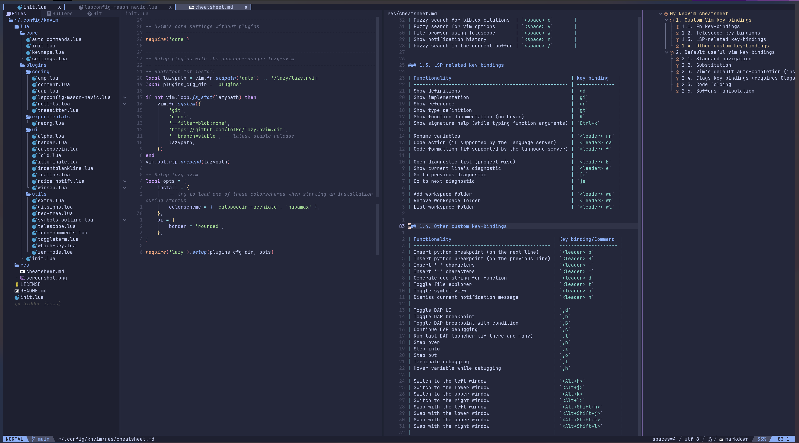

# KNVIM

K-nvim or kn-vim, personal attempt to config Neovim and a pun on my username knmac.


## Demo

Config structure and cheatsheet:


Editing a python file, with LSP, Tree-sitter, and Symbols-outline support


## Manual installation

### Prerequisites

The following prerequisites are for manual installation.
- Neovim 0.9.0+. Follow the installation guide on Neovim's [homepage](https://neovim.io/). This repo is just holding the config.
- A [nerd-font](https://www.nerdfonts.com/) for the glyphs.
- `npm` for Mason (installer for LSP).
- `rg` and `fd` for Telescope (fuzzy finder).

### Installation

Clone this repo to `$HOME/.config`:

```bash
git clone https://github.com/knmac/knvim.git $HOME/.config/knvim
```

Then add this command to `.bashrc` or `.zshrc`.

```bash
export NVIM_APPNAME="knvim"
```

### Removing knvim

Simply delete the two directories `$HOME/.config/knvim` and `$HOME/.local/share/knvim`.


## Installation using nvim-lazyman

 is a configuration manager that supports popular Neovim configurations. After installing `nvim-lazyman`, run the folling command to install knvim:

```bash
lazyman -w Knvim
```

Follow instructions from  for details about installation, boostrapping, and other cool features.


## Knvim Cheatsheet

Cheatsheet for knvim can be found [here](res/cheatsheet.md). You can also access cheatsheet from the start page.
