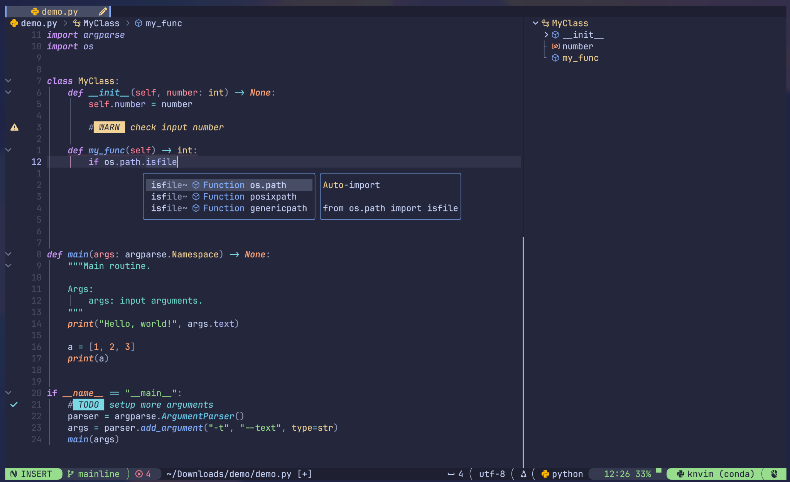

# KNVIM

K-nvim or kn-vim, personal attempt to config Neovim and a pun on my username knmac.

## 1. Demo
<!--  -->
Video demo with clickable lualine


Config structure and cheatsheet


Editing a python file, with LSP, Tree-sitter, and Symbols-outline support



## 2. Feature highlights

- Targeting python, bash, latex, markdown, and (*some*) C/C++ usage
- [Lualine](https://github.com/nvim-lualine/lualine.nvim) is configured to be (*mostly*) clickable
- Key-biddings that (*hopefully*) make sense
- Fun (*for me*) to use!!!


## 3. Config structure

```
init.lua
lua/
├── core/
│  ├── auto_commands.lua
│  ├── init.lua
│  ├── keymaps.lua
│  └── settings.lua
└── plugins/
   ├── coding/
   │  ├── cmp.lua
   │  ├── comment.lua
   │  ├── dap.lua
   │  ├── lspconfig-mason.lua
   │  ├── metals.lua
   │  ├── nonels.lua
   │  └── treesitter.lua
   ├── experimentals/
   │  └── ...
   ├── ui/
   │  ├── alpha.lua
   │  ├── barbar.lua
   │  ├── catppuccin.lua
   │  ├── fold.lua
   │  ├── illuminate.lua
   │  ├── indentblankline.lua
   │  ├── lualine.lua
   │  ├── navic-barbecue.lua
   │  ├── noice-notify.lua
   │  └── winsep.lua
   ├── utils/
   │  ├── diffview.lua
   │  ├── extra.lua
   │  ├── gitsigns.lua
   │  ├── neo-tree.lua
   │  ├── neorg.lua
   │  ├── swenv.lua
   │  ├── symbols-outline.lua
   │  ├── telescope.lua
   │  ├── todo-comments.lua
   │  ├── toggleterm.lua
   │  ├── which-key.lua
   │  └── zen-mode.lua
   └── init.lua
```

The configs in `experimentals/` directories are not activated by default. To use them, uncommment the following line in `lua/plugins/init.lua`:

```lua
{ import = 'plugins.experimentals', },
```


## 3. Manual installation

### 3.1. Prerequisites

The following prerequisites are for manual installation.
- Neovim 0.9.0+. Follow the installation guide on Neovim's [homepage](https://neovim.io/). This repo is just holding the config.
- A [nerdfont](https://www.nerdfonts.com) for the glyphs and a terminal that supports the font (the screenshots use [WezTerm](https://wezfurlong.org/wezterm/) and its baked-in [JetBrains Mono](https://www.jetbrains.com/lp/mono/) font).
- `npm` for [mason.nvim](https://github.com/williamboman/mason.nvim) (package manager for LSPs, DAPs, linters, and formaters).
- `rg` and `fd` for [telescope.nvim](https://github.com/nvim-telescope/telescope.nvim) (fuzzy finder).
- (Optional) [LazyGit](https://github.com/jesseduffield/lazygit) for quick git management from [ToggleTerm](https://github.com/akinsho/toggleterm.nvim).

### 3.2. Installation

Clone this repo to `$HOME/.config`:

```bash
git clone https://github.com/knmac/knvim.git $HOME/.config/knvim
```

Then add this command to `.bashrc` or `.zshrc`.

```bash
export NVIM_APPNAME="knvim"
```

### 3.3. Removing knvim

Simply delete the two directories `$HOME/.config/knvim` and `$HOME/.local/share/knvim`.


## 4. Installation using nvim-lazyman

[Nvim-lazyman](https://github.com/doctorfree/nvim-lazyman) is a configuration manager that supports popular Neovim configurations. After installing `nvim-lazyman`, run the folling command to install knvim:

```bash
lazyman -L Knvim
```

Follow instructions from [nvim-lazyman](https://github.com/doctorfree/nvim-lazyman) for details about installation, boostrapping, and other cool features.


## 5. Knvim Cheatsheet

Cheatsheet for knvim can be found [here](res/cheatsheet.md). You can also access cheatsheet from the start page.

## 6. Extra configs (optional)

This section shows you how to set up extra configuration for knvim to work as you want (completely optional)

### 6.1. Ruff (Python linter) and Black (Python formater)

Create the file `pyproject.toml` for each Python project, where the content looks something like this:

```toml
[tool.ruff]
line-length = 100
select = ["E", "F"]
ignore = ["E501", "E402"]

[tool.black]
line-length = 100
```

For more information, visit [here](https://docs.astral.sh/ruff/configuration/) and [here](https://python-poetry.org/docs/pyproject/).

### 6.2. DAP (Debugging tool)

Create the file `.vscode/launch.json` for each project, where the content looks something like this:

```json
{
    // Use IntelliSense to learn about possible attributes.
    // Hover to view descriptions of existing attributes.
    // For more information, visit: https://go.microsoft.com/fwlink/?linkid=830387
    "version": "0.2.0",
        "configurations": [
        {
            "name": "NAME OF THE LAUNCH",
            "type": "python",
            "request": "launch",
            "program": "${file}",
            "console": "integratedTerminal",
            "args": ["TOKEN1", "TOKEN2", ...]
        }
    ]
}
```

The above config uses Python as an example, but you can setup debugger for other languages similarly. For more information, visit [here](https://go.microsoft.com/fwlink/?linkid=830387).

### 6.3. Diffview (Intergate Diffview to git mergetool automatically)

Create the file `~/.gitconfig` globally, where the content looks something like this:

```git_config
[merge]
    tool = nvim
[mergetool]
    keepBackup = false
    prompt = false
[mergetool "nvim"]
    cmd = "nvim -d -c \"wincmd l\" -c \"norm ]c\" \"$LOCAL\" \"$MERGED\" \"$REMOTE\" -c DiffviewOpen"
```
